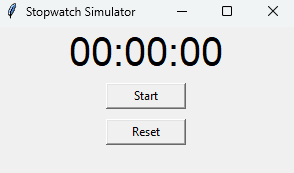

Mini Project Report: Stopwatch Simulator
1. Title
Stopwatch Simulator Using Python

2. Introduction
The Stopwatch Simulator is a graphical user interface (GUI) application built using Python and the Tkinter library. The application simulates the functionality of a real-world stopwatch, allowing users to start, stop, and reset the stopwatch with ease. It displays the time in a minutes:seconds format and provides interactive buttons to control the stopwatch.

3. Objective
The objective of this project is to design and implement a simple stopwatch using Python. The main features of the stopwatch include:

Start and stop functionality.
Reset functionality.
Display time in minutes:seconds format.
4. Technologies Used
Python: The primary programming language.
Tkinter: A built-in Python library used for creating the GUI.
5. Features
Start Button: Starts or resumes the stopwatch.
Stop Button: Pauses the stopwatch.
Reset Button: Resets the stopwatch to 0:00.
Time Display: Shows the elapsed time in minutes and seconds format.
6. Project Implementation
The stopwatch functionality is implemented using the time module in Python, which keeps track of elapsed time. The Tkinter library is used for creating the graphical interface with interactive buttons and a display for the time.

